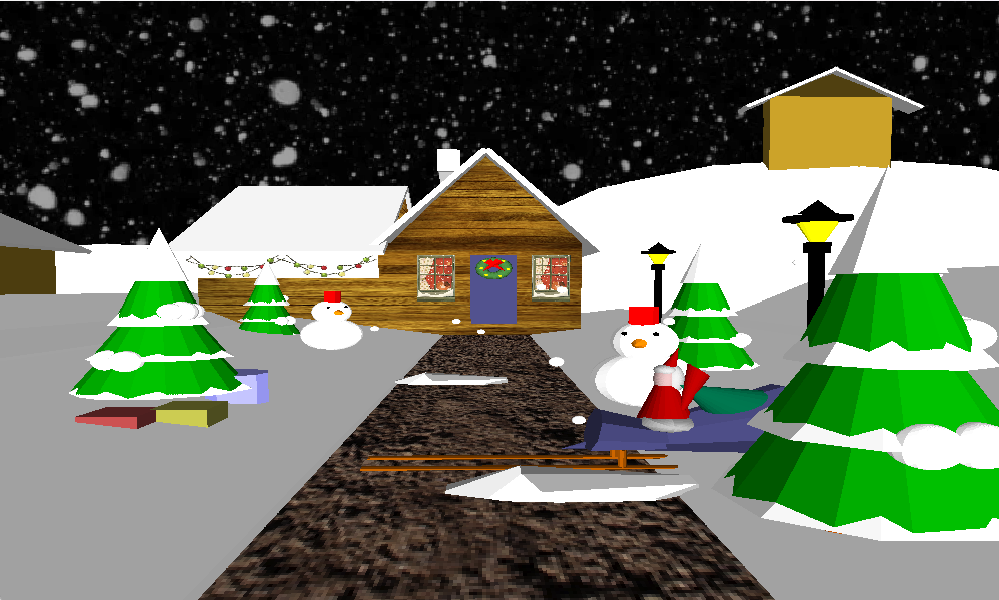
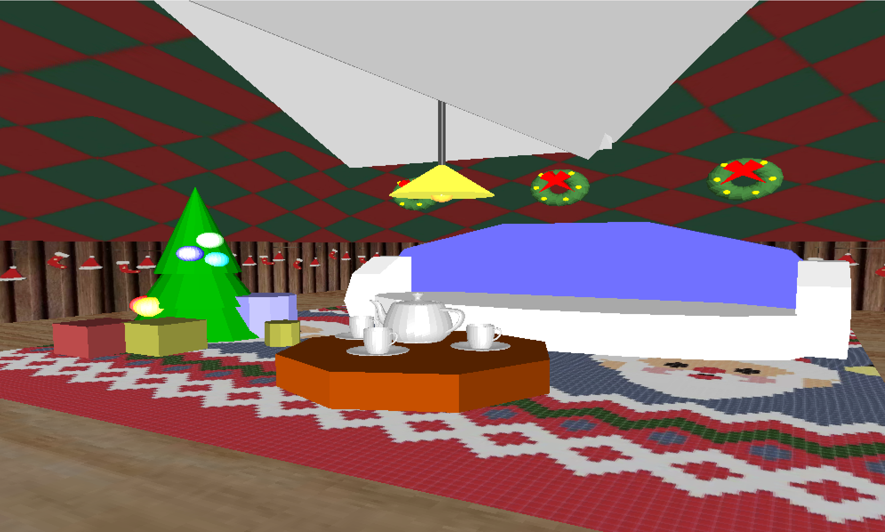
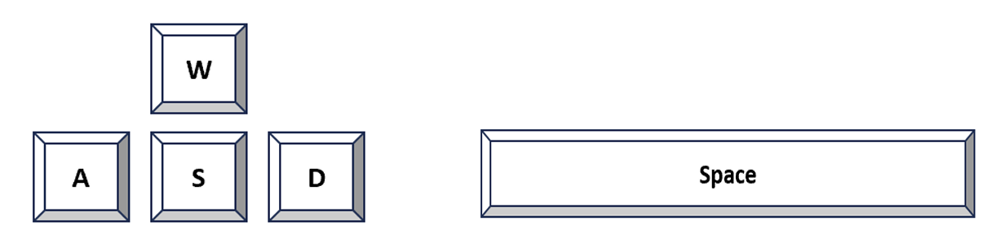
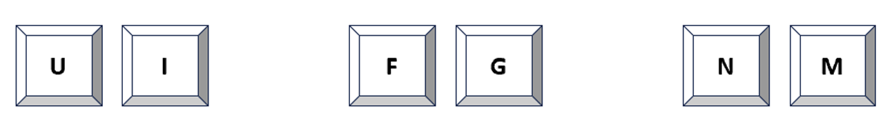
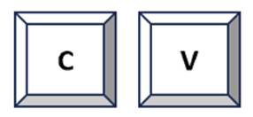
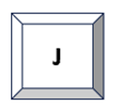

# Christmas-Village

## Introduction 
My design concept aims to develop an interactive Christmas scene, allowing users 
to experience the festive atmosphere. Christmas encompasses various elements, making it an 
excellent opportunity to showcase the graphics techniques and OpenGL functions covered in 
the course. 

In this project, I have designed a Christmas village scene as illustrated in the image below, 
which contains several static and moving objects. It consists of two main parts: the village and 
the interiors of the cottage. 
 
>
    

Figure 1: The village 
 
>
    

Figure 2: The interiors of the cottage 

Similar to many games, the Christmas scene is constructed from a first-person perspective, 
allowing users to control movement and direction through keyboard inputs. Intermittently, 
there will be some small interactive tasks woven into the experience to enhance user 
engagement. 

## Techniques 
In this design project, a significant number of necessary graphics techniques were employed. 
**Creation of Geometry**: All objects in the project involve a substantial amount of geometric 
creation. For instance, cones are used for Christmas trees, spheres for the snowman, and 
cubes for houses. 
**Hierarchical Modeling**: In this project, the use of stack's push and pop operations is 
employed to break down objects into distinct components. This facilitates the construction of 
an object's hierarchical tree. Take the sled as an example, the figure below shows the 
hierarchical modeling tree structure of the sled. 

Figure 3: The hierarchical modeling tree structure of the sled 

**Transformations**: Various transformation techniques such as translate, scale, and rotate are 
heavily employed throughout the project. 
Viewing and Projection: Camera movements, including camera pan and zoom, are utilized 
to control the view of the scene. 
**Lighting and Materials**: The project primarily adopts ambient lighting sources, and different 
objects have their respective reflection properties. For instance, the specular attributes on 
objects like teacups and light bulbs are intensified to create a metallic effect. 
Texture Mapping: Over a dozen textures are used in the project, not only for flat surfaces 
like wallpaper, carpets, and windows but also for curved surfaces such as patterned wrapping 
paper on gifts. 
**Animation and Interactions**: Various animations are implemented, including snowfall, Santa 
Claus waving, and interactions like basic visual transformations such as forward, backward, 
left, and right movements. Additionally, there are scene transitions between indoors and 
outdoors, jumping over obstacles, sled movements, and snowball throwing. 

## Design and Features 
**Scene Design** 
Village Scene includes houses, Christmas trees, snow, a pathway, street lamps, snowmen, 
Christmas wreaths, a sled, and Santa Claus. 
The interior of the cottage includes a fireplace, sofa, table, teapot, teacups, carpet, Christmas 
tree, gifts, wallpaper, electric lights, and Christmas wreaths. 
**Interaction Design**
Besides basic movement and perspective changes, the project includes some small interactive 
elements to enhance user engagement. The interactions mainly take place in the village scene. 
 
1. Throw snowballs: Pressing the 'j/J' to throw snowballs. Use the 'a/A' and 'd/D' keys to 
control the direction of the snowball. 
2. Jump over snow barriers: While walking on the pathway, users may encounter snow 
barriers. Press the spacebar to jump over them. 
3. Get on/off the sled: Click the left mouse button to move the sled, and click the left 
mouse button to get on/off the sled.

## Instructions 
⚫ Movement and View Change: 
**w/W**: Forward  **s/S**: Backward  **a/A**: Look left  **d/D**: Look right  Spacebar: Jump 

>
    

**u/U**: look up  **i/I**: look down  **f/F**: fly up  **g/G**: fly down  **n/N**: zoom in  **m/M**: zoom out 

>
    

⚫ Sled： 
**Left mouse button**: sled slide    
**Right mouse button**: get on/off the sled 

>
    

⚫ Scene Switching: 
**c/C**: Switch to Inside the Cottage Scene    
**v/V**: Switch to the Village Scene 

>
    

⚫ Snowball: 
**j/J**: Throw a snowball 

>
    

